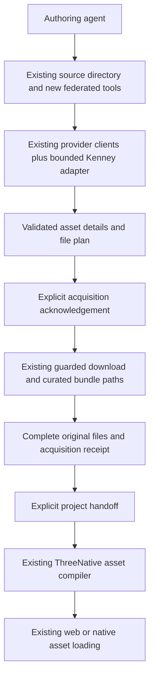

# PRD — Federated asset discovery and selective 3d-asset-server adoption

**Status:** NOT STARTED — proposed design; documentation-only draft for later review.
**Priority:** P2 — reduce provider-selection friction and incomplete asset downloads without replacing working asset tools.
**Date:** 2026-10-05 (America/Vancouver)
**Implementation owner:** `jonit-dev/threenative-asset-mcp`.
**Engine consumer:** `ThreeNativeHQ/threenative`; a later, separately verified package-version adoption, not an engine-MCP rewrite.
**Progress:** 0/7 implementation boxes; 0/1 acceptance box. No implementation or release is authorized by this document alone.

## Decision

**Absorb the useful capabilities, not the whole server.** Add a small federated discovery and acquisition layer over the existing provider clients. Selectively adapt upstream provider parsing and file-selection ideas where they save work, with attribution and tests. Do not install, fork wholesale, proxy, or run `3d-asset-server` as a second required service.

The first release covers item-level search across existing model/material/environment providers, dependency-complete downloads through existing guarded transports, and fuller **Kenney 3D-pack discovery**. Additional providers are staged follow-ups, not prerequisites for this PRD.

This is an authoring improvement, not a rendering-performance feature. Success is fewer agent calls to find a genuinely usable asset, preserved provenance, and a complete local acquisition. It does not imply higher FPS, better art selection, or a model becoming compatible with every runtime merely because it downloaded.

## Evidence and baseline

Source inspection on the date above used these repository snapshots:

| Repository | Ref | Commit |
| --- | --- | --- |
| `arielshad/3d-asset-server` | `main` | `1e7eae7e44352e6b381142b185538706be4cbe22` |
| `jonit-dev/threenative-asset-mcp` | `main` | `80a7ddb0cf763f3ee960741a4695d9da9f18513c` |
| `ThreeNativeHQ/threenative` | `develop` | `ba72eed258b1aefabb9744dc86fd8282c3ab39a5` |

The companion package declares version **0.9.5**; the inspected engine dependency pins **0.9.5**. Matching version strings are not proof that a published tarball equals repository source. Release acceptance must inspect the actual packaged consumer. [S1] [S7]

Upstream registers 17 sources, but that is not 17 new downloadable catalogs. Its registry overlaps ours, and some entries only supply search-page links. Its `AssetService` provides useful parallel item search and per-provider reports. Our `asset_search_sources` instead searches a static directory of sources: it does not federate actual asset listings. These are different operations and both should remain. [S2] [S3] [S14]

| Capability | Existing ThreeNative asset MCP | Relevant upstream contribution | Decision |
| --- | --- | --- | --- |
| Provider discovery | `asset_list_sources`, `asset_search_sources`, capability and licensing cautions | Another provider registry | Extend our registry; do not duplicate it. |
| Item-level search | Separate Fab, Poly Haven, ambientCG, Smithsonian and Sketchfab tools | One fan-out search, ranking, provider outcomes | Add a thin federated tool over existing clients. |
| Fab and specialized workflows | Guarded free downloads, owned-asset import, Unreal conversion, rigs, audio and curated bundles | Upstream Fab is a linked source; general discovery is its focus | Preserve our deeper workflows and public contracts. |
| Kenney | Curated audio and a particle-pack entry | Broader catalog and detail-page parsing | Add 3D-pack discovery first; keep current curated entries. |
| File selection | Provider file lists and a guarded single-file downloader | Format/resolution selection and glTF companion expansion | Add validated multi-file orchestration, not a replacement downloader. |
| Asset cooking | Existing engine `@threenative/assets` compiler | Download gateway, not ThreeNative's target-aware cooker | Hand off original files; reuse the compiler. |
| Serving and analytics | Existing local MCP launch/configuration | HTTP API, web UI, analytics/census and deployment surface | Do not absorb these subsystems. |

The table is based on the registered tools, source directory, downloader, bundle client and engine package documentation, not just project descriptions. [S2] [S4] [S5] [S6] [S7] [S8]

### Why not reuse the implementation unchanged?

Static review found specific mismatches, not demonstrated exploits or a completed security audit:

- Upstream's `freeOnly` filter retains assets whose price is unknown (`free !== false`). Our free-only contract must require affirmative evidence for the selected offering.
- Its search offset is per provider, not a stable global cursor. Its final ranking function does not establish cross-provider deduplication. Do not promise complete globally paginated results by copying it.
- Its downloader checks the initial public URL while the HTTP client follows redirects automatically. It permits HTTP as well as HTTPS. Preserve our provider-specific HTTPS and redirect validation instead.
- Its ZIP extraction reads the archive and expands it synchronously in memory without an explicit expanded-byte or entry-count budget. Its normal file writes are not a whole-asset atomic transaction.
- Its Kenney cold-catalog path can request up to 40 pages in parallel. Do not reproduce that fan-out in an agent's first query.
- It uses `@modelcontextprotocol/sdk` 1.x; this repository uses `@modelcontextprotocol/server` 2.0.0. Keep our transport and registration API rather than bringing in a second MCP stack.

These observations come from the inspected source, and are reasons for selective adaptation rather than claims about provider reliability in production. [S1] [S3] [S5] [S9] [S10] [S11] [S13]

## Goals and boundaries

An agent requesting “a downloadable wooden chair with known commercial-use terms” should discover individual candidates in one call, distinguish missing authorization from missing files, inspect a selected variant, and explicitly acquire complete original files. It should not have to infer whether a provider name represents a working download integration.

V1 federates `3d-model`, `texture`, `hdri` and `animation`, using the existing source-directory vocabulary. A pack is an asset with `itemKind: pack`, not an invented set of individually indexed models. Existing audio, 2D, icons, rigging and other tools remain available unchanged; they are not forced into a new normalized API in this release.

Out of scope: a second MCP server; a hosted upstream dependency; a web editor or HTTP gateway; analytics/census; broad crawling; paid checkout or asset claiming; credential acquisition; automatic rerigging or cooking; a scene format; engine capability-search changes; and a second runtime asset manifest. General-purpose ZIP extraction is also out of scope. A downloaded ZIP is explicitly an archive, not a render-ready model.

## Architecture and ownership

Networking, source normalization and acquisition live here. `packages/engine-mcp` in the engine repository stays an offline capability-manifest service with its existing two tools. `@threenative/assets` remains the only cooking pipeline; target support comes from that pipeline and runtime validation, not from marketplace metadata. [S7] [S8] [S15]

Suggested implementation seams, not mandatory new packages:

| Existing seam | Intended change |
| --- | --- |
| `src/tools/source-directory.ts` | Reuse source IDs and taxonomy; expose new capability information additively. |
| `src/server.ts` and `src/tools/` | Register three additive tools using the existing MCP SDK and error conventions. |
| Provider `client.ts` modules | Add optional cancellation/context support only where needed; preserve existing callers. |
| Small `src/discovery/` modules | Own adapters, normalized schemas, fan-out and deterministic ranking; do not duplicate provider HTTP clients. |
| `src/download/direct-asset-downloader.ts`, `src/bundle/client.ts` | Reuse transport/path guards; compose validated files into a whole-asset transaction. |
| Small `src/kenney/` module | Port only needed listing/detail parsing, decoupled from upstream census and server code. |

Do not refactor unrelated rig, creature, audio or Unreal code. In-flight fixes in those areas are not prerequisites for this work. Existing specialized tools remain the authority for workflows the generic acquisition tool cannot safely execute.

## Proposed MCP contract

All names and fields below are **proposed**, not currently shipped commands. Add exactly three public tools. Keep `asset_list_sources` and `asset_search_sources`; do not add a redundant `list_providers` alias.

### `asset_search`

Input: `query`, `types`, optional `providers`, `freeOnly` (default true), `downloadableOnly` (default false), optional commercial-use/attribution constraints, and `limit` (default 20, maximum 50).

Output: bounded `results`, one report per selected provider, `partial`, `searchedAt`, and a notice that this is a bounded search page rather than a catalog census. Each candidate includes:

- A stable, unambiguous `assetId` encoding provider ID plus provider-native ID; canonical source URL; title; supported type; `itemKind`; thumbnail URL when supplied.
- Price and license evidence, including the selected offering where relevant. Unknown values remain unknown. A free Fab tier does not make every tier free.
- `downloadStatus: direct | auth-required | manual | unsupported | unknown`, a reason, and `canDownloadNow`. The latter means the current integration can acquire the selected files after explicit acknowledgement; it does not grant permission to act.
- Provider rank and an explanation of relevant ranking factors. Asset names, descriptions and provider instructions are untrusted data, never commands to execute.

A source-level `agentReady` flag is not proof that every asset from that source is downloadable. A source page is returned in provider reports, not fabricated as an individual asset result. Unknown price fails `freeOnly`; unknown commercial-use permission fails an explicitly requested commercial-use filter. Missing metadata is never silently converted to zero geometry, CC0, or “no attribution required.”

V1 deliberately has **no global pagination contract**. Return `truncated` per provider and a validated continuation action using an existing provider tool when available. Never sum incompatible provider totals or advertise upstream's shared offset as a global cursor.

### `asset_get`

Input: `assetId`, optional explicit `format`, `resolution` and desired texture-map roles.

Output: authoritative available detail, authorship and licensing evidence, session-aware acquisition capability, and a file plan when one can be constructed. Preserve provider-specific details rather than flattening away license tiers, glTF dependencies, archive status or authentication requirements.

The file plan includes a bounded `planToken`, expiry, selected file IDs, relative paths, roles, byte sizes/checksums when supplied, dependencies, a summary of license acknowledgement requirements, and a selection explanation. Default selection prefers GLB, then dependency-complete glTF. A 2k texture preference is an overridable acquisition heuristic, not a new engine quality default. Never upscale or silently substitute preview images for source assets. A requested unavailable format returns an explicit alternative, not a mislabeled file.

Prefer known complete variants over guessed ones. For PBR maps, preserve supplied color-space/channel/normal-convention metadata; unknown conventions stay unknown. Do not infer a runtime material graph from a filename alone.

`asset_get` is read-only: it never downloads large payloads, acquires a license, starts a conversion or changes a project. A plan is not consent.

### `asset_download`

Input: `planToken`, explicit `acceptLicense: true`, and optional `maxBytes` that may tighten, but never exceed, the configured server cap. No caller-supplied arbitrary URL, output root, shell command or credentials.

Resolve the token to a server-held validated plan, not instructions reconstructed from model-supplied JSON. Recheck expiry, capability, licensing and selected variant before acquisition. Changed terms or selected files invalidate the plan and require another `asset_get` and acknowledgement. Refreshing a signed URL for the same verified file is not a license change.

V1 executes only workflows supported by existing guarded acquisition paths. Keep Fab-specific EULA/owned-library flows in their specialized tools; do not synthesize their acknowledgements. Sketchfab's authenticated download-URL resolver must not be mistaken for an already-supported generic disk downloader. Return a concrete existing-tool action or an honest unsupported/manual result when the generic transport cannot complete the operation.

Success returns local paths, total bytes, SHA-256 values, an acquisition receipt and `runtimeReadiness: unverified`. An archive additionally reports `requiresExtraction: true`. Do not auto-extract arbitrary ZIPs or report an archive as a usable GLB. Search and download never imply automatic project adoption.

## Reliability, ranking and resource limits

Use existing client caches where suitable; the federation layer must not create a second cache with conflicting freshness or credential semantics. Coalesce identical in-flight metadata requests within the same provider and authorization context; private results must never cross credential scopes. Bound cached metadata by entries and bytes, and never cache a bearer token, cookie or signed download URL in public results or receipts.

Proposed initial limits: four concurrent provider requests, eight seconds per provider, ten seconds for one aggregate search, and at most 50 returned results. Queue time counts against the aggregate deadline. Make limits configurable within validated bounds. Propagate cancellation to the actual HTTP operations; abandoning a promise while its requests keep running does not satisfy the deadline contract.

Every selected provider reports `ok`, `timeout`, `error`, `rate-limited`, `auth-required`, `manual`, or `skipped`, with a bounded reason and available `retryAfter`. Partial success is valid; all-provider failure is an explicit failure, not an empty successful search. Do not start a browser or an authentication flow simply because a generic search selected Fab. Any opt-in expensive provider mode must be explicit and reported.

Rank with deterministic lexical relevance and provider-local order, then modest usability boosts and source diversity. Stable tie-breaks use provider ID and native ID. Deduplicate by provider/native identity and verified canonical aliases; do not merge different authors' assets because their titles match. Ranking weights are tunable heuristics, not measured quality claims. Validate them against a fixed query corpus before changing defaults.

Kenney metadata acquisition must be page-limited and rate-limited. Prefer bounded on-demand queries or a refreshed bounded index; never fetch 40 pages concurrently at first use. Respect provider access restrictions and `Retry-After`. Parser drift is an observable failure, not evidence that a provider suddenly has no assets.

## Safe acquisition and provenance

Retain the existing HTTPS provider allowlists and redirect-by-redirect validation. Do not introduce a general “public URL” bypass. New hosts or paths require provider-specific evidence and negative tests. Reject credentials in URLs, traversal, absolute paths, path collisions, symlink escapes and unsupported dependencies. Guard model companion URLs exactly like the top-level file.

Reuse guarded file transfers, but stage the complete selected dependency set under controlled storage. Publish a whole-asset receipt only after all required files are present and verified. A failure may retain valid internal cache entries; it must not publish a supposedly complete asset, overwrite an unrelated file, or leave a project pointing at half an asset. Repeated acquisition must verify the cached files and plan identity, not trust filename existence alone.

Enforce both known-size preflight and streamed aggregate byte limits, including companion files. Bound file count and dependency depth. Because generic archive extraction is not included, do not claim an expanded-archive safety guarantee. Existing curated bundle extraction retains its own limits and tests; broader extraction needs a separate bounded design.

Store an `asset.acquisition.json` receipt beside acquired originals: schema version, provider/native identity, canonical source and license URLs, author/credit text, fetched time, tool version, acknowledged terms identifier or digest, selected variant, relative paths, roles, sizes and SHA-256 values. Distinguish asset-license attribution from API-credit requirements, including Poly Haven's visible service credit. [S4]

The receipt is authoring provenance, **not** `assets.manifest.json` and not a runtime dependency. Keep credentials out of all tool output. Do not add temporary signed URLs to the new generic tool results, receipts, logs or errors; preserve the existing specialized authenticated URL-resolver contract without persisting its transient URLs. Engine handoff copies explicitly selected originals into the existing source tree; the normal compiler owns compiled outputs and its existing manifest. No ambient auto-import, scene edits or hidden network requirement enters a shipped game.

## Provider adoption order

| Stage | Provider work | Release condition |
| --- | --- | --- |
| This PRD | Wrap existing supported model/material/environment clients and known curated packs | Preserve specialized tools and report actual per-item capability. |
| This PRD | Kenney 3D-pack listings, detail metadata and guarded ZIP acquisition | Bounded fixtures plus one opt-in official-source qualification; verify terms on the selected pack. |
| Next candidate | TextureCan | Evaluate current official access, item licensing, stable file resolution and parser fixtures before adding it. No capability claim is made here. |
| Later, opt-in | BlenderKit | Evaluate credentials, free/paid distinction, download permissions and actual formats; do not treat it as a turnkey GLB library. |
| Deferred | Broader Quaternius, CGBookcase, ShareTextures, 3DTextures.me, HDRMaps, HDRI Hub, Textures.com, CGTrader and generic itch.io coverage | Add only where verified access and usable assets justify maintenance; preserve stronger existing curated routes. |
| No replacement | Existing Fab integration; link-only marketplace directory entries | No downgrade to upstream link-only behavior and no inflated provider-count goal. |

No hosted third-party gateway, anti-bot bypass, bulk mirroring or automatic purchase is needed to satisfy this PRD.

## Reuse and licensing

Upstream is Apache-2.0; this package currently declares `UNLICENSED`. Do not silently change this repository's licensing, and do not relabel copied upstream code as exclusively proprietary. Any adapted implementation must preserve the upstream license and applicable notices, identify modified files and record the source commit. Include required third-party material in the published package, not only the repository. Check for an upstream NOTICE and retain applicable content if present. [S1] [S10] [S12]

Prefer our existing orchestration, schemas and SDK. Port the small provider parsers or selection functions only where that is simpler than an original implementation. Record adapted files in a compact third-party notice rather than carrying the upstream server, UI, analytics and dependency graph. Do not copy large provider page fixtures or redistribute asset payloads without checking their separate permissions. Code license, catalog access terms and asset reuse rights are three distinct questions.

## Implementation order

All boxes are unimplemented. Test names below describe planned suites; the commands are existing package commands, not claims that those suites already exist.

### Phase 1 — Federated discovery without breaking existing tools

- [ ] Expose item-level federation through adapters over the existing provider registry and clients. proof: `npm test` with new adapter and legacy-tool contract fixtures.
- [ ] Bound federated search and report partial failures without losing successful provider results. proof: `npm test` with deterministic ranking, duplicate, timeout, cancellation and rate-limit fixtures.
- [ ] Return truthful per-item capabilities and dependency-aware plans from `asset_get`. proof: `npm test` with unknown-license, free-tier, authentication, format and companion-file fixtures.

### Phase 2 — Complete guarded acquisition

- [ ] Publish dependency-complete acquisitions atomically through the existing guarded download paths. proof: `npm test` with multi-file success, interruption, redirect, path, byte-budget and cache-integrity fixtures.
- [ ] Emit a non-secret acquisition receipt that preserves the selected asset's provenance. proof: `npm test` with receipt-schema, attribution, changed-terms and redaction fixtures.

### Phase 3 — Useful new coverage and packaged delivery

- [ ] Add bounded Kenney 3D-pack discovery and guarded archive acquisition. proof: `npm test` with Kenney parser/transport fixtures; an explicitly invoked provider probe qualifies one official pack before enabling the provider by default.
- [ ] Expose the additive tool contract from the built package without breaking existing MCP registration. proof: `npm run typecheck && npm run build && npm test`, including a new stdio consumer smoke test against the built entry point.

## Acceptance criteria

- [ ] A credential-free consumer completes the two acquisition scenarios below through public MCP tools. proof: `npm test` with a new end-to-end acquisition fixture using a local controlled HTTP transport and the built MCP entry point.

Scenario A: search for a model, select a glTF variant with external buffer and texture dependencies, acquire the complete set, and load it from disk with the existing glTF tooling while external network access is disabled. The receipt identifies every delivered file; a missing companion fails by name.

Scenario B: search for a Kenney 3D pack, inspect its evidenced terms, acknowledge its plan and acquire the exact archive. Report it as an archive requiring extraction, not as a render-ready model. Retrying with a tampered cached file must not produce a successful unchanged receipt.

Inject a test transport that serves controlled fixtures for valid provider URLs; do not add a production localhost or allowlist-bypass switch. All current specialized-tool regression tests remain required. Live-provider probes are separate from deterministic unit/consumer tests; record exact source, date and result, and do not convert rate limits or unavailable credentials into passing tests.

Proposed release measurements, not baseline findings: one aggregate search discovers candidates from at least two successful providers in the controlled corpus; 100% of selected required files appear in a successful receipt; all selected provider failures are visible; invalid or expired plans perform zero downloads; new search/get calls perform zero project writes. Report p50/p95 cold and warm search latency, provider request counts and peak metadata memory without claiming an engine FPS improvement.

## Engine adoption and rollout

Keep the new generic tools additive. Release the asset MCP only after its ordinary package gates and this PRD's acceptance pass. Do not remove old tools or change their default behavior to force migration. Preserve existing download roots and explicit acknowledgements.

ThreeNative adoption happens after a real package release: inspect the published tarball, update the actual engine dependency pins and lockfile, verify existing project MCP setup, and exercise the acquired originals through `@threenative/assets`. Use the existing web/native harness for any runtime compatibility claim; a successful MCP transaction does not prove desktop or mobile rendering. No engine pin or lockfile is changed by this draft.

Rollback disables the new federation/Kenney registrations or restores the previous package pin without removing acquired originals or changing existing provider tools. No persistent server infrastructure or data migration is required.

## Blocked on

Publishing and engine adoption require the maintainer's release authorization and registry credentials; neither is requested or used by this draft. They do not block implementing deterministic tests locally.

Live qualification of any provider requires current allowed access and item-level license evidence. A provider that cannot be qualified stays disabled or explicitly manual; it does not block a partial existing-provider federation release, but that partial release does not complete this PRD. Do not enable a Kenney adapter by default until its live qualification is recorded.

Optional future authenticated integrations require the user's own credentials. Do not acquire them, borrow sessions or weaken the download guard to make a test pass.

## Decisions

2026-10-05 — User requested evaluation and a PRD in an open PR for later work. This PR is documentation only; no implementation, publication, dependency bump or merge is included.

2026-10-05 — Proposed engineering recommendation: keep the existing asset MCP and selectively absorb discovery/file-planning/provider ideas. The owner has not yet approved the design or implementation schedule.

2026-10-05 — Scope choice: existing providers plus Kenney 3D packs first; leave additional catalogs, generic archive extraction and a hosted service outside this PRD. Keep engine capability lookup and asset cooking separate.

## Verification of this draft

Repository source and package metadata were inspected through GitHub. No provider integration was executed, no benchmark was run, no downloaded asset was validated and no product tests passed as part of this drafting task. Local checkout acquisition failed because the execution environment could not resolve GitHub; full repository gates are therefore unrun. Document-structure and read-back verification results belong in the PR body, separate from the unchecked implementation work above.

## Source references

[S1]: https://github.com/jonit-dev/threenative-asset-mcp/blob/80a7ddb0cf763f3ee960741a4695d9da9f18513c/package.json
[S2]: https://github.com/jonit-dev/threenative-asset-mcp/blob/80a7ddb0cf763f3ee960741a4695d9da9f18513c/src/tools/source-directory.ts
[S3]: https://github.com/arielshad/3d-asset-server/blob/1e7eae7e44352e6b381142b185538706be4cbe22/src/core/service.ts
[S4]: https://github.com/jonit-dev/threenative-asset-mcp/blob/80a7ddb0cf763f3ee960741a4695d9da9f18513c/README.md
[S5]: https://github.com/jonit-dev/threenative-asset-mcp/blob/80a7ddb0cf763f3ee960741a4695d9da9f18513c/src/download/direct-asset-downloader.ts
[S6]: https://github.com/jonit-dev/threenative-asset-mcp/blob/80a7ddb0cf763f3ee960741a4695d9da9f18513c/src/bundle/client.ts
[S7]: https://github.com/ThreeNativeHQ/threenative/blob/ba72eed258b1aefabb9744dc86fd8282c3ab39a5/packages/core/package.json
[S8]: https://github.com/ThreeNativeHQ/threenative/blob/ba72eed258b1aefabb9744dc86fd8282c3ab39a5/packages/assets/README.md
[S9]: https://github.com/arielshad/3d-asset-server/blob/1e7eae7e44352e6b381142b185538706be4cbe22/src/core/download.ts
[S10]: https://github.com/arielshad/3d-asset-server/blob/1e7eae7e44352e6b381142b185538706be4cbe22/package.json
[S11]: https://github.com/arielshad/3d-asset-server/blob/1e7eae7e44352e6b381142b185538706be4cbe22/src/core/http.ts
[S12]: https://github.com/arielshad/3d-asset-server/blob/1e7eae7e44352e6b381142b185538706be4cbe22/LICENSE
[S13]: https://github.com/arielshad/3d-asset-server/blob/1e7eae7e44352e6b381142b185538706be4cbe22/src/providers/kenney.ts
[S14]: https://github.com/arielshad/3d-asset-server/blob/1e7eae7e44352e6b381142b185538706be4cbe22/src/providers/index.ts
[S15]: https://github.com/ThreeNativeHQ/threenative/blob/ba72eed258b1aefabb9744dc86fd8282c3ab39a5/packages/engine-mcp/README.md

Specific upstream inspiration: [provider registry][S14], [search orchestration][S3], [file selection and companions][S9], and [Kenney parsing][S13]. The offline engine boundary is documented in [the engine MCP README][S15].
